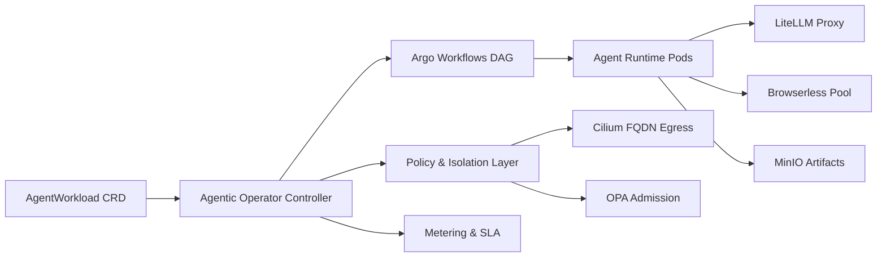

# Agentic Kubernetes Operator

[](LICENSE)
[](go.mod)
[](https://github.com/Clawdlinux/agentic-operator-core/actions/workflows/ci.yml)
[](https://github.com/Clawdlinux/agentic-operator-core/actions/workflows/test-gates.yml)

**Run AI agents on Kubernetes with policy isolation, cost attribution, and zero platform lock-in.**

> One `AgentWorkload` manifest. Namespace isolation. Model routing. Artifact retention. All on your cluster.

---

<p align="center">
  <a href="#-quick-start"><strong>Quick Start</strong></a> &nbsp;&middot;&nbsp;
  <a href="https://clawdlinux.org"><strong>Website</strong></a> &nbsp;&middot;&nbsp;
  <a href="docs/04-architecture.md"><strong>Architecture</strong></a> &nbsp;&middot;&nbsp;
  <a href="CONTRIBUTING.md"><strong>Contribute</strong></a> &nbsp;&middot;&nbsp;
  <a href="ROADMAP.md"><strong>Roadmap</strong></a>
</p>

---

## Why Agentic Operator?

Platform teams running AI agents on Kubernetes today face a painful reality: each agent framework expects its own runtime, its own secrets, its own network rules. You end up with a sprawl of bespoke Deployments, no cost visibility, and no guardrails.

**Agentic Operator fixes this.** One CRD, one controller, full-stack isolation:

| Problem | Agentic Operator |
|---------|-----------------|
| Agent sprawl across namespaces | Single `AgentWorkload` CRD per agent |
| No network boundaries | Cilium FQDN egress policies auto-applied |
| Invisible costs | Per-workload token metering + cost attribution |
| Manual DAG wiring | Argo Workflows orchestrates agent steps |
| Vendor lock-in | Any LLM via LiteLLM proxy routing |

## Demo

```
$ kubectl apply -f agentworkload.yaml
agentworkload.agentic.clawdlinux.org/research-run created

$ kubectl get agentworkload research-run -w
NAME           PHASE       AGE
research-run   Pending     0s
research-run   Isolating   2s    # namespace + cilium policy applied
research-run   Running     5s    # argo workflow launched
research-run   Completed   47s   # artifacts retained in minio

$ kubectl logs -n aw-research-run agent-pod --tail=5
[agent] analyzing Q1 2026 technology trends...
[agent] sources: arxiv, github trending, HN front page
[agent] cost: $0.0023 (gpt-4o-mini) | tokens: 1,847 in / 892 out
[agent] output written to minio://research-run/report.md
[agent] run complete — 42s wall time
```

## Quick Start

**Option A — One command (requires kind + helm):**
```bash
curl -sSL https://raw.githubusercontent.com/Clawdlinux/agentic-operator-core/main/scripts/install.sh | bash
```

**Option B — Step by step:**
```bash
git clone https://github.com/Clawdlinux/agentic-operator-core
cd agentic-operator-core

# Create local cluster
kind create cluster --name agentic-operator

# Install CRD + operator
kubectl apply -f config/crd/agentworkload_crd.yaml
helm dependency build ./charts
helm upgrade --install agentic-operator ./charts \
  --namespace agentic-system --create-namespace

# Deploy your first agent
kubectl apply -f config/agentworkload_example.yaml
kubectl -n agentic-system get agentworkloads -w
```

**Option C — GitHub Codespaces (zero local setup):**

[](https://codespaces.new/Clawdlinux/agentic-operator-core?devcontainer_path=.devcontainer/devcontainer.json)

## Architecture



## What's Included

| Component | Description |
|-----------|-------------|
| **AgentWorkload CRD** | Declarative spec for agent objective, model, quotas, egress rules |
| **Controller** | Reconciles workloads → namespaces, network policies, workflows, artifacts |
| **Argo Integration** | Agent steps execute as DAG nodes with retries and timeouts |
| **Cilium Policies** | FQDN-based egress lock-down auto-generated per workload |
| **LiteLLM Routing** | Cost-aware model selection across providers (OpenAI, Anthropic, Cloudflare) |
| **MinIO Artifacts** | Per-workload bucket for prompts, logs, outputs, audit trails |
| **Multi-tenancy** | Namespace isolation with quota enforcement per tenant |
| **Python Agent Runtime** | Batteries-included agent framework with tool integrations |

## Repository Layout

```
cmd/                    Operator entrypoint
internal/controller/    Reconciliation logic
api/v1alpha1/           CRD API types and schema
agents/                 Python agent runtime
charts/                 Helm umbrella chart
config/                 CRD, RBAC, sample manifests
docs/                   Documentation
pkg/                    Shared packages (billing, license, autoscaling, routing)
tests/                  Integration + E2E test suites
```

## Documentation

| Doc | Description |
|-----|-------------|
| [Quick Start](docs/01-quickstart.md) | 5-minute setup guide |
| [Installation](docs/02-installation.md) | Production deployment options |
| [Configuration](docs/03-configuration.md) | CRD fields, Helm values, tuning |
| [Architecture](docs/04-architecture.md) | System design deep dive |
| [Troubleshooting](docs/10-troubleshooting.md) | Common issues and fixes |

## Open Source Boundary

This repository is the **open-source core**. It contains everything needed to run agent workloads on Kubernetes.

The [private companion](https://github.com/Clawdlinux/agentic-operator-private) adds enterprise features:
- License validation and trial enforcement
- Usage metering and billing integration
- Production DOKS deployment overlays

## Contributing

We welcome contributions! See [CONTRIBUTING.md](CONTRIBUTING.md) for guidelines.

```bash
# Fork, clone, create a branch
git checkout -b feat/my-improvement

# Run tests
make test

# Submit a PR
```

## Roadmap

See [ROADMAP.md](ROADMAP.md) for the public roadmap and quarterly milestones.

## License

Apache License 2.0 — See [LICENSE](LICENSE).
